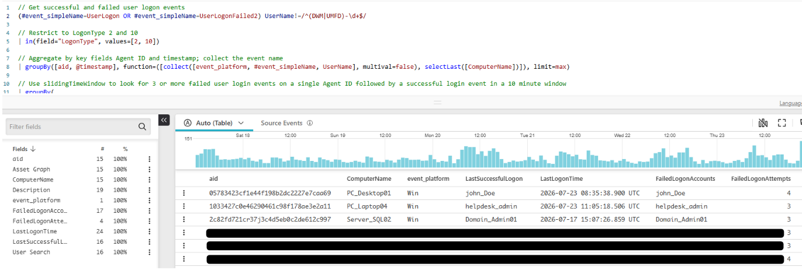

# Successful Login After Multiple Failed Logon Attempts
<br>

## 🎯 Objective
<br>

Detect users who successfully authenticate after multiple failed logon attempts on the same endpoint within a 10-minute period. This helps identify potential brute force attacks, password spraying, credential guessing, or users repeatedly entering incorrect passwords before eventually succeeding.
<br>

---
<br>

## 💡 Use Cases
<br>

- Detect successful brute force attacks.
- Identify password spraying activity resulting in a valid login.
- Investigate suspicious logon patterns preceding account compromise.
<br>

---
<br>

## 🔍 Detection Logic
<br>

```text
UserLogonFailed2 + UserLogon Events
                ↓
Filter Logon Types 2 and 10
                ↓
Count Failed Attempts per Host
                ↓
3+ Failed Logons Within 10 Minutes
                ↓
Successful Logon on Same Host
                ↓
Potential Credential Abuse
```

<br>

---
<br>

## 🧠 Query
<br>

```sql
// Get successful and failed user logon events
(#event_simpleName=UserLogon OR #event_simpleName=UserLogonFailed2) UserName!=/^(DWM|UMFD)-\d+$/

// Restrict to LogonType 2 and 10
| in(field="LogonType", values=[2, 10])

// Aggregate by key fields Agent ID and timestamp; collect the event name
| groupBy([aid, @timestamp], function=([collect([event_platform, #event_simpleName, UserName], multival=false), selectLast([ComputerName])]), limit=max)

// Use slidingTimeWindow to look for 3 or more failed user login events on a single Agent ID followed by a successful login event in a 10 minute window
| groupBy(
   aid,
   function=slidingTimeWindow(
       [{#event_simpleName=UserLogonFailed2 | count(as=FailedLogonAttempts)}, {collect([UserName]) | rename(field="UserName", as="FailedLogonAccounts")}],
       span=10m
   ), limit=max
 )

// Rename fields
| rename([[UserName,LastSuccessfulLogon],[@timestamp,LastLogonTime]])

// Failed logon threshold
| FailedLogonAttempts >= 3

// Successful logon event
| #event_simpleName=UserLogon

// Convert timestamp to readable format
| LastLogonTime:=formatTime(format="%F %T.%L %Z", field="LastLogonTime")

// User Search
| rootURL := "https://falcon.eu-1.crowdstrike.com/"
| format("%sinvestigate/dashboards/user-search?isLive=false&sharedTime=true&start=7d&user=%s", field=["rootURL", "LastSuccessfulLogon"], as="User Search")

// Asset Graph
| format("%sasset-details/managed/%s", field=["rootURL", "aid"], as="Asset Graph")

// Description
| Description:=format(format="User %s logged on to system %s (Agent ID: %s) successfully after %s failed logon attempts were observed on the host.", field=[LastSuccessfulLogon, ComputerName, aid, FailedLogonAttempts])

// Final output
| groupBy([aid, ComputerName, event_platform, LastSuccessfulLogon, LastLogonTime, FailedLogonAccounts, FailedLogonAttempts, "User Search", "Asset Graph", Description], function=[], limit=max)
```
### Output Example

<br>

---
<br>

## ⚙️ How It Works
<br>

### Step 1
<br>

The query retrieves both successful (`UserLogon`) and failed (`UserLogonFailed2`) authentication events while excluding Windows-managed service accounts such as DWM-* and UMFD-*.

<br>

### Step 2
<br>

A sliding 10-minute time window calculates the number of failed logons observed on each endpoint (`aid`). The query records the usernames involved and identifies hosts where at least three failed logons occur.

<br>

### Step 3
<br>

The query checks whether a successful logon occurs after the failed-attempt threshold is met. The final output provides context including hostname, username, timestamp, failed account list, and direct Falcon investigation links.

<br>

---
<br>

## 🕵️ Investigation Tips
<br>

- Check whether the successful account appears in the failed logon list.
- Review `LogonType`, `ComputerName`, `aid`, and authentication timestamps.
- Look for unusual login times, privileged accounts, or subsequent suspicious activity.
- Investigate associated IP addresses and authentication sources if available.
- Search for account lockouts, MFA failures, or lateral movement shortly after the successful login.

<br>

---
<br>

## 🚨 Potential False Positives
<br>

- Users mistyping their password multiple times.
- Recently changed passwords not updated across devices.
- Mobile phones or Wi-Fi profiles using stale credentials.
- Shared workstations used by multiple users.
- Cached credentials generating authentication failures.

<br>

---
<br>

## 🎯 MITRE ATT&CK Mapping
<br>

| Technique | Description |
|---|---|
| T1110 | Brute Force |
| T1110.001 | Password Guessing |
| T1110.003 | Password Spraying |
| T1078 | Valid Accounts |

<br>

---
<br>

## 📝 Analyst Notes
<br>

This query is excellent for detecting the transition from failed authentication activity to a successful login, which is often a critical indicator of compromise. While many results will be benign user behavior, analysts should prioritize investigations involving privileged accounts, remote interactive logons (LogonType 10), unusual login times, and endpoints showing additional suspicious activity after authentication.

For production detections, consider increasing the threshold (e.g., 5-10 failed attempts) or restricting the logic to privileged accounts to reduce noise.
<br>
