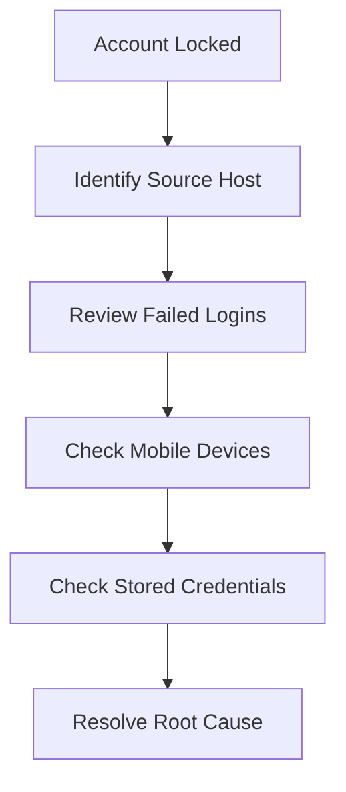
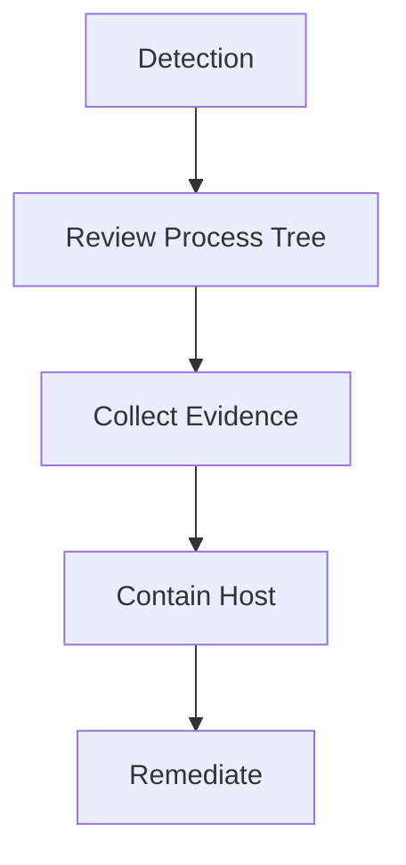

# 🔎 CrowdStrike Falcon - Advanced Event Search (AES)

> A practical guide to CrowdStrike Falcon Advanced Event Search for threat hunting, incident response, detection engineering, and day-to-day SOC operations.


---

## 📚 Table of Contents

- [What iss-aes
-ng
- [PowerShell Hunting](#-powersork-hunting
- [USB Activity Hunting](#-usb-vestigation-playbooks
- [Useful Queries](#-useful 🎯 What is AES?

Advanced Event Search (AES) allows analysts to search Falcon telemetry collected from endpoints and identity sources.

### Common Use Cases

✅ Threat Hunting  
✅ Incident Response  
✅ Malware Investigations  
✅ Authentication Analysis  
✅ Endpoint Triage  
✅ Detection Validation

---

## 🔤 Search Syntax

### Basic Search

```sql
event_simpleName=ProcessRollup2
```

### Search by User

```sql
UserName="Leonardo"
```

### Search by Host

```sql
ComputerName="SERVER01"
```

### Search by Process

```sql
ImageFileName="powershell.exe"
```

---

## 🔐 Authentication Hunting

### Failed Logins

```sql
event_simpleName=UserLogonFailed2
```

### Account Lockouts

```sql
event_simpleName=UserAccountLocked
```

### Investigation Tips

> - Review source IP addresses
> - Identify stale credentials
> - Check mobile devices
> - Verify VPN clients
> - Review scheduled tasks

---

## ⚙️ Process Hunting

### PowerShell Executions

```sql
event_simpleName=ProcessRollup2
ImageFileName=*powershell.exe*
```

### CMD Executions

```sql
event_simpleName=ProcessRollup2
ImageFileName=*cmd.exe*
```

### Process Tree Analysis

```text
explorer.exe
└── powershell.exe
    └── whoami.exe
```

---

## 💻 PowerShell Hunting

### Encoded Commands

```sql
event_simpleName=ProcessRollup2
CommandLine=*EncodedCommand*
```

### DownloadString Usage

```sql
event_simpleName=ProcessRollup2
CommandLine=*DownloadString*
```

### Red Flags

| Indicator | Risk |
|------------|--------|
| EncodedCommand | High |
| Invoke-Expression | Medium |
| DownloadString | High |
| Hidden Window | Medium |
| Bypass | Medium |

---

## 🌐 Network Hunting

### Connections

```sql
event_simpleName=NetworkConnectIP4
```

### What To Review

- Source IP
- Destination IP
- Destination Port
- Username
- Process Name

---

## 💾 USB Activity Hunting

### USB Device Insertions

```sql
event_simpleName=RemovableMediaVolumeMounted
```

### Useful Information

- Device Serial
- User
- Host
- Timestamp

---

## 📖 Investigation Playbooks

### User Account Lockout



### Malware Investigation



---

## 🚀 Useful Queries

### Top Failed Logins

```sql
event_simpleName=UserLogonFailed2
| stats count by UserName
```

### PowerShell Activity

```sql
event_simpleName=ProcessRollup2
ImageFileName=*powershell.exe*
```

### RDP Sessions

```sql
event_simpleName=RemoteDesktopSessionEstablished
```

### Service Creation

```sql
event_simpleName=ServiceStarted
```

---

## 📝 Notes & Lessons Learned

> Add real-world investigation cases here.

### Example

**Issue:** User repeatedly locked out.  
**Root Cause:** Mobile phone using old password for Wi-Fi authentication.  
**Resolution:** Remove saved credentials and reconnect to Wi-Fi.

---

## ⚠️ Disclaimer

This guide contains personal notes and investigation techniques intended for authorized cybersecurity and incident response activities.
